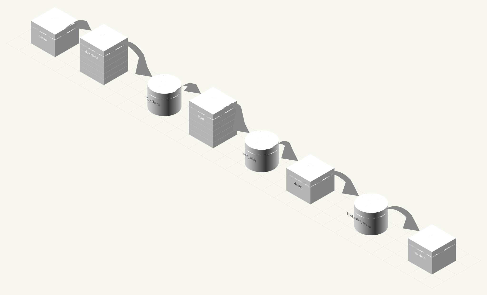

# dbtopo-bricks

[](https://github.com/lbruand-db/dbtopo-bricks/actions/workflows/ci.yml)
[](https://github.com/astral-sh/ruff)
[](https://www.python.org/downloads/)

Load the [IGN BD TOPO](https://geoservices.ign.fr/bdtopo) database (French national topographic dataset) into Databricks Delta tables with **native GEOMETRY** support.

BD TOPO v3.5 is a comprehensive 3D vector description of the French territory at metric precision, covering 60 layers across 9 themes: administrative boundaries, addresses, buildings, hydrography, named places, land cover, public services, transport networks, and regulated zones. It is maintained by the [Institut national de l'information geographique et forestiere (IGN)](https://www.ign.fr/) and available as open data. See the [official documentation](https://geoservices.ign.fr/sites/default/files/2024-11/DC_BDTOPO_3-5.pdf) for the full data model.

## What it does

Downloads department-level GeoPackage (GPKG) files from IGN's GeoServices, extracts them, and writes them into Unity Catalog Delta tables using Databricks native `GEOMETRY` type with server-side reprojection via `ST_Transform` -- orchestrated as a Databricks Job via Asset Bundles.

## Pipeline



Each department is processed independently and in parallel (up to 10 concurrent)
via Databricks Jobs `for_each_task`. The dedup step removes features that appear
in multiple departments (border overlap), keeping one row per `cleabs` identifier.

## Key features

- **Native GEOMETRY type** -- stored as Databricks `GEOMETRY(4326)`, enabling direct use of all `ST_*` geospatial functions
- **Server-side reprojection** -- Lambert 93 (EPSG:2154) to WGS84 (EPSG:4326) via `ST_Transform`, no local pyproj needed
- **Native date types** -- `DateType` / `TimestampType` via `TRY_CAST` (tolerates malformed source timestamps)
- **Parallel GPKG ingestion** -- batch reads distributed across Spark executors via `mapInPandas`, not sequential on the driver
- **Rich metadata** -- table and column comments from official IGN BD TOPO v3.5 data model, bilingual (English/French)
- **48 layers** across 9 INSPIRE themes with full metadata coverage
- **Flexible compute** -- runs on serverless (client v4+) or classic compute (DBR 17.3 LTS+)

## Quick start

### Prerequisites

- [uv](https://docs.astral.sh/uv/) for Python package management
- [Databricks CLI](https://docs.databricks.com/dev-tools/cli/index.html) authenticated to your workspace

### Local development

```bash
# Install dependencies
uv sync

# Run tests (76 tests, no Spark/Java needed)
uv run pytest -v

# Build wheel
uv build --wheel --out-dir dist
```

### Deploy to Databricks

```bash
# Validate bundle
databricks bundle validate

# Deploy (builds wheel automatically via uv)
databricks bundle deploy

# Run the job (downloads + loads department 001 by default)
databricks bundle run bdtopo_load

# Override departments
databricks bundle run bdtopo_load --params departments=075,092
```

### Targets

| Target | Catalog | Departments | Description |
| ------ | ------- | ----------- | ----------- |
| dev | lucasbruand_catalog | all 96 | Full dataset for development |
| e2e_test | timo_roest_test | 001 (arrondissement only) | Fast e2e validation |
| staging | staging_catalog | 001,075,092 | A few departments |
| prod | prod_catalog | all 96 | All departments, production mode |

```bash
databricks bundle deploy -t prod
databricks bundle run bdtopo_load -t prod
```

## Job tasks

The `bdtopo_load` job runs with 6 tasks (default config uses serverless with client v4+):

1. **setup_catalog** -- Creates Unity Catalog schema and volume
2. **download** -- `for_each_task` over departments (up to 10 parallel). Downloads .7z archives from `data.geopf.fr` to a UC volume with MD5 verification
3. **extract_and_load** -- `for_each_task` over departments (up to 10 parallel). Extracts GPKG to Volume, then uses Spark `mapInPandas` to distribute batch reads across executors in parallel. Each executor reads a GPKG slice via pyogrio, converts geometry to WKT, and returns the data via Arrow. Server-side `ST_GeomFromWKT` + `ST_Transform` converts to native GEOMETRY(4326). Single distributed Delta write per layer. Tables are pre-created with column and table comments from IGN metadata.
4. **dedup** -- Deduplicates all tables by `cleabs` (IGN unique ID) into `*_dedup` tables, removing border-overlap duplicates
5. **validate** -- Checks that all tables (including `_dedup`) have data
6. **validate_native_geometry** -- Comprehensive validation of native GEOMETRY type, SRID, coordinate ranges, ST_* functions, and spatial queries

## Data source

- **BD TOPO v3.5** from [IGN GeoServices](https://geoservices.ign.fr/bdtopo)
- Downloaded per department from `data.geopf.fr`
- 60 layers across 9 themes (administrative, addresses, buildings, hydrography, named places, land cover, services, transport, regulated zones)
- Source CRS: Lambert 93 (EPSG:2154), reprojected to WGS84 (EPSG:4326) server-side

## Table metadata

Tables are created with rich metadata from the official IGN BD TOPO v3.5 data model documentation:

- **Table-level comments** describing the layer and its BD TOPO version
- **Column-level comments** for all known columns (common attributes + layer-specific)
- **Table properties** storing CRS, BD TOPO version, and version date
- **Bilingual** -- comments can be in English (default) or French via the `lang` parameter

Example:
```sql
DESCRIBE TABLE catalog.schema.ign_bdtopo_batiment;
-- cleabs    string    Unique object identifier in BD TOPO
-- hauteur   double    Building height from ground to gutter in meters
-- geometry  geometry  Native geometry (EPSG:4326), reprojected from Lambert-93 via ST_Transform
```

## Project structure

```
dbtopo-bricks/
├── databricks.yml              # DAB bundle definition
├── pyproject.toml              # Python package (uv/hatch)
├── notebooks/
│   ├── 00_setup_catalog.py     # UC resource creation
│   ├── 01_validate_native_geometry.py  # Comprehensive geometry validation
│   └── 02_list_layer_sizes.py  # Layer size exploration
├── src/dbtopo/
│   ├── cli.py                  # Click CLI + Databricks entry points
│   ├── config.py               # Pydantic configuration
│   ├── dedup.py                # Table deduplication logic
│   ├── downloader.py           # IGN download with MD5 verification
│   ├── extractor.py            # 7z extraction
│   ├── gpkg_reader.py          # GPKG batch ranges + CRS extraction for parallel Spark reads
│   ├── metadata.py             # Bilingual BD TOPO column/table descriptions
│   ├── schema.py               # Spark schema from GPKG metadata
│   ├── task_values.py          # Databricks job task value helpers
│   ├── transformer.py          # CRS extraction + WKT conversion
│   └── writer.py               # Delta table writer + metadata
├── tests/
│   ├── fixtures/
│   │   ├── test_D001_batiment.gpkg
│   │   └── test_bad_datetime.gpkg
│   ├── test_config.py
│   ├── test_dedup.py
│   ├── test_downloader.py
│   ├── test_extractor.py
│   ├── test_gpkg_reader.py
│   ├── test_metadata.py
│   ├── test_parse_departments.py
│   ├── test_schema.py
│   ├── test_task_values.py
│   ├── test_transformer.py
│   ├── test_writer.py
│   └── test_writer_spark.py
└── SPECS/
    └── SPEC.md                 # Detailed specification
```

## Tech stack

| Component | Library |
| --------- | ------- |
| Download | requests (with retry) |
| Archive extraction | py7zr |
| GPKG reading | pyogrio, geopandas |
| Geometry | Databricks native GEOMETRY + ST_* functions |
| CRS reprojection | Databricks ST_Transform (server-side) |
| Spark / Delta | pyspark (Databricks Runtime) |
| Package manager | uv |
| Deployment | Databricks Asset Bundles |
| Orchestration | Databricks Jobs (serverless client v4+ or DBR 17.3 LTS+) |
| Linting | ruff |
| Type checking | ty |
| CI | GitHub Actions |

## Requirements

- **Databricks Runtime 17.3 LTS+** (for native GEOMETRY type and ST_* geospatial functions)
- If using **serverless compute**, environment client version **4+** is required
- Unity Catalog enabled workspace
- Python 3.10+

## Data attribution

This project uses [BD TOPO](https://geoservices.ign.fr/bdtopo) data from the Institut national de l'information geographique et forestiere (IGN), released under the [Licence Ouverte Etalab 2.0](https://www.etalab.gouv.fr/licence-ouverte-open-licence/). This licence permits free use, modification, and redistribution (including commercial) with attribution. Source: IGN -- BD TOPO v3.5.
