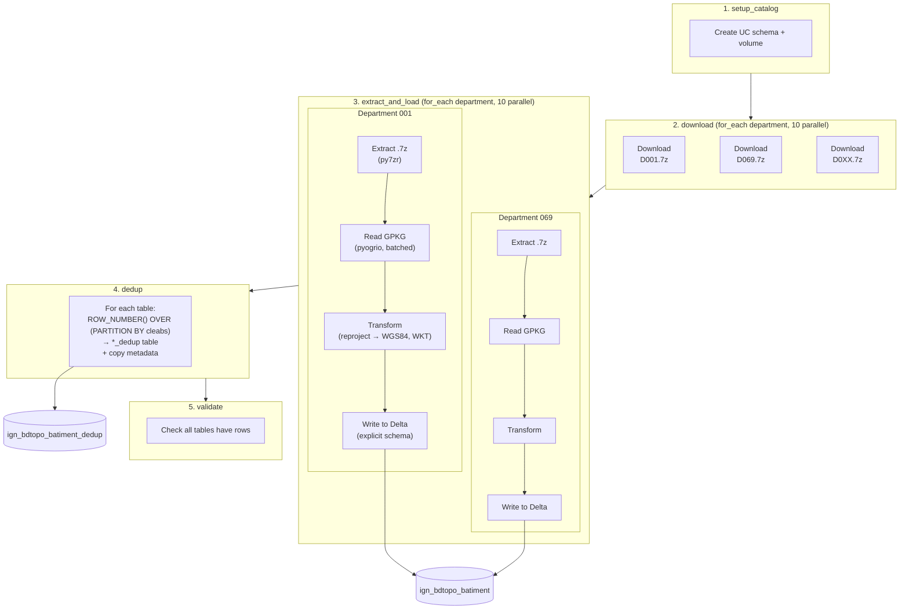

# dbtopo-bricks

[](https://github.com/lbruand-db/dbtopo-bricks/actions/workflows/ci.yml)
[](https://github.com/astral-sh/ruff)
[](https://www.python.org/downloads/)

Load the [IGN BD TOPO](https://geoservices.ign.fr/bdtopo) database (French national topographic dataset) into Databricks Delta tables with geometry support.

## What it does

Downloads department-level GeoPackage (GPKG) files from IGN's GeoServices, extracts them, reprojects geometries to WGS84, and writes them into Unity Catalog Delta tables — orchestrated as a Databricks Job via Asset Bundles.

## Pipeline



Each department is processed independently and in parallel (up to 10 concurrent)
via Databricks Jobs `for_each_task`. The dedup step removes features that appear
in multiple departments (border overlap), keeping one row per `cleabs` identifier.

## CI

Every push and pull request to `main` runs three jobs via GitHub Actions:

- **lint** — `ruff check` and `ruff format --check`
- **typecheck** — `ty check`
- **test** — `pytest` with the GPKG test fixtures

## Quick start

### Prerequisites

- [uv](https://docs.astral.sh/uv/) for Python package management
- [Databricks CLI](https://docs.databricks.com/dev-tools/cli/index.html) authenticated to your workspace

### Local development

```bash
# Install dependencies
uv sync

# Run tests
uv run pytest -v

# Build wheel
uv build --wheel --out-dir dist
```

### Deploy to Databricks

```bash
# Validate bundle
databricks bundle validate

# Deploy (builds wheel automatically via uv)
databricks bundle deploy

# Run the job (downloads + loads department 001 by default)
databricks bundle run bdtopo_load

# Override departments
databricks bundle run bdtopo_load --params departments=075,092
```

### Targets

| Target | Catalog | Departments | Description |
| ------ | ------- | ----------- | ----------- |
| dev | lucasbruand_catalog | 001 | Single department for testing |
| staging | staging_catalog | 001,075,092 | A few departments |
| prod | prod_catalog | all | All 96+ departments |

```bash
databricks bundle deploy -t prod
databricks bundle run bdtopo_load -t prod
```

## Job tasks

The `bdtopo_load` job runs on serverless compute with 5 tasks:

1. **setup_catalog** — Creates Unity Catalog schema and volume
2. **download** — `for_each_task` over departments (up to 10 parallel). Downloads .7z archives from `data.geopf.fr` to a UC volume with MD5 verification
3. **extract_and_load** — `for_each_task` over departments (up to 10 parallel). Extracts GPKG, reads layers in batches, reprojects to WGS84, writes to Delta with explicit schema from GPKG metadata
4. **dedup** — Deduplicates all tables by `cleabs` (IGN unique ID) into `*_dedup` tables, removing border-overlap duplicates. Copies table properties, comments, and column comments
5. **validate** — Checks that all tables (including `_dedup`) have data

## Data source

- **BD TOPO v3.5** from [IGN GeoServices](https://geoservices.ign.fr/bdtopo)
- Downloaded per department from `data.geopf.fr`
- 58 layers across 8 themes (administrative, buildings, hydrography, transport, etc.)
- Source CRS: Lambert 93 (EPSG:2154), reprojected to WGS84 (EPSG:4326)

## Project structure

```
dbtopo-bricks/
├── databricks.yml              # DAB bundle definition
├── pyproject.toml              # Python package (uv/hatch)
├── notebooks/
│   └── 00_setup_catalog.py     # UC resource creation
├── src/dbtopo/
│   ├── cli.py                  # Click CLI + Databricks entry points
│   ├── config.py               # Pydantic configuration
│   ├── dedup.py                # Table deduplication logic
│   ├── downloader.py           # IGN download with MD5 verification
│   ├── extractor.py            # 7z extraction
│   ├── gpkg_reader.py          # Batched pyogrio/geopandas reader
│   ├── schema.py               # Spark schema from GPKG metadata
│   ├── task_values.py          # Databricks job task value helpers
│   ├── transformer.py          # Reproject + WKT conversion
│   └── writer.py               # Delta table writer + metadata
├── tests/
│   ├── fixtures/
│   │   ├── test_D001_batiment.gpkg
│   │   └── test_bad_datetime.gpkg
│   ├── test_config.py
│   ├── test_dedup.py
│   ├── test_downloader.py
│   ├── test_extractor.py
│   ├── test_gpkg_reader.py
│   ├── test_parse_departments.py
│   ├── test_schema.py
│   ├── test_task_values.py
│   ├── test_transformer.py
│   ├── test_writer.py
│   └── test_writer_spark.py
└── SPECS/
    └── SPEC.md                 # Detailed specification
```

## Tech stack

| Component | Library |
| --------- | ------- |
| Download | requests (with retry) |
| Archive extraction | py7zr |
| GPKG reading | pyogrio, geopandas |
| Geometry ops | shapely, pyproj |
| Spark / Delta | pyspark (Databricks Runtime) |
| Package manager | uv |
| Deployment | Databricks Asset Bundles |
| Orchestration | Databricks Jobs (serverless) |
| Linting | ruff |
| Type checking | ty |
| CI | GitHub Actions |
